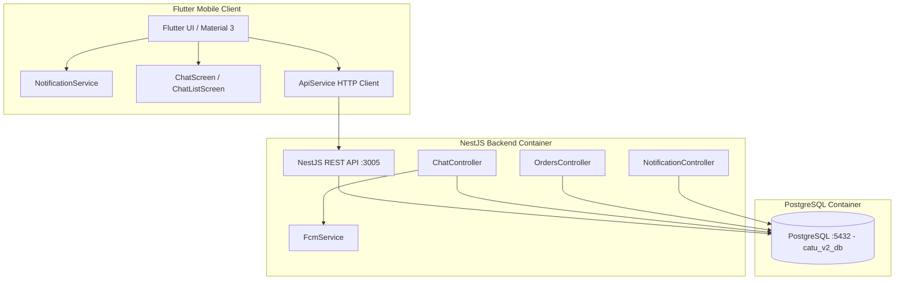

# 📖 CATU v2 - System Handover & Technical Documentation

> **Status Repository:** `Clean` | **Branch:** `main`  
> **Terakhir Diperbarui:** 2 September 2026  
> **Kompatibilitas:** AI Model / Full-Stack Developer Handover

---

## 📌 1. Ringkasan Eksekutif (*Executive Summary*)

Dokumen ini memuat seluruh rekam jejak arsitektur, modifikasi database, implementasi notifikasi (FCM & Real-Time In-App Polling), perbaikan aset ikon native, deep-linking ruang obrolan, serta petunjuk operasional lengkap untuk melanjutkan pengembangan aplikasi **CATU (Catholic Assistance & Touch Unit) v2**.

---

## 🏗️ 2. Arsitektur & Tech Stack



### Stack Spesifikasi:
* **Backend:** NestJS 10, TypeORM, TypeScript, Firebase Admin SDK (FCM).
* **Database:** PostgreSQL 16 (Port `5432`, DB `catu_v2_db`, User `postgres`, Pass `postgres`).
* **Mobile:** Flutter 3.29+ / Dart 3.7+, Material 3 (`flutter_local_notifications: ^17.2.3`, `http: ^1.2.0`, `shared_preferences: ^2.2.2`).
* **Infrastruktur:** Docker Compose, Colima VM (macOS Darwin ARM64).

---

## 🗄️ 3. Skema Database & Migrasi Terbaru

### A. Tabel `notifications` (Updated)
Telah ditambahkan kolom `chat_group_id` dengan relasi FK ke `chat_groups(id)`.

```sql
ALTER TABLE notifications 
ADD COLUMN IF NOT EXISTS chat_group_id bigint REFERENCES chat_groups(id) ON DELETE CASCADE;
```

**Struktur Lengkap Tabel `notifications`:**
| Kolom | Tipe Data | Keterangan |
| :--- | :--- | :--- |
| `id` | `bigint PRIMARY KEY` | Auto-increment sequence |
| `user_id` | `bigint NOT NULL` | FK `auth_users(id)` penerima notifikasi |
| `order_id` | `bigint NULL` | FK `orders(id)` jika terkait transaksi pelayanan |
| `chat_group_id` | `bigint NULL` | **FK `chat_groups(id)` (Eksak untuk notifikasi chat)** |
| `title` | `varchar(150) NOT NULL` | Judul notifikasi |
| `body` | `text NOT NULL` | Pesan / cuplikan notifikasi |
| `type` | `varchar(50) NOT NULL` | Tipe notifikasi (`CHAT_MESSAGE`, `NEW_REQUEST`, `ROMO_ACCEPTED`, dll) |
| `is_read` | `boolean NOT NULL` | Default `false` |
| `created_at` | `timestamptz NOT NULL` | Default `CURRENT_TIMESTAMP` |

### B. Tabel-tabel Kunci Terkait Chat & Order:
* `chat_groups`: Menyimpan grup chat (`id`, `order_id`, `title`, `last_message_text`, `last_message_at`).
* `chat_messages`: Riwayat chat (`id`, `chat_group_id`, `sender_id`, `message_type`, `message`, `attachment_url`, `created_at`).
* `chat_group_members`: Anggota grup & read receipts (`chat_group_id`, `user_id`, `role_in_group`, `last_read_message_id`).
* `orders`: Transaksi pelayanan (`id`, `order_number`, `user_id`, `service_category_id`, `status`, dll).

---

## 🔔 4. Sistem Notifikasi & Deep-Linking Routing

### A. Alur Notifikasi Chat Multi-Pesan (Bebas Tabrakan ID)
1. Ketika pengguna mengirim pesan via `POST /chat/groups/:groupId/messages`:
   * Backend menyimpan pesan ke `chat_messages`.
   * Mengambil seluruh anggota `chat_group_members` selain pengirim.
   * Menyisipkan baris notifikasi ke tabel `notifications` dengan **`chat_group_id = :groupId` secara eksplisit**.
   * Mengirim push notification FCM ke `device_tokens` aktif.
2. Endpoint `GET /notifications?userId=:userId`:
   * Menggunakan query `LEFT JOIN LATERAL` bebas duplikasi:
     ```sql
     SELECT n.id, n.user_id as "userId", n.order_id as "orderId", 
            COALESCE(n.chat_group_id, cg.id) as "groupId",
            n.title, n.body, n.type, n.is_read as "isRead", n.created_at as "createdAt",
            o.order_number as "orderNumber", sc.name as "categoryName",
            o.status as "orderStatus"
     FROM notifications n
     LEFT JOIN orders o ON n.order_id = o.id
     LEFT JOIN service_categories sc ON o.service_category_id = sc.id
     LEFT JOIN LATERAL (
       SELECT id FROM chat_groups WHERE order_id = n.order_id ORDER BY id ASC LIMIT 1
     ) cg ON n.chat_group_id IS NULL
     WHERE n.user_id = $1
     ORDER BY n.id DESC LIMIT 100
     ```

### B. Perilaku Klik Notifikasi (*Tap Action*):
* `NotificationService.handleNotificationTap(payloadStr)`:
  * **💬 Pesan Chatting (`CHAT_MESSAGE`)**:
    * Membaca `groupId` dan `orderNumber` dari payload JSON.
    * Melakukan *push navigation* langsung ke **`ChatScreen`** ruang percakapan tersebut.
  * **🔔 Notifikasi Umum Lainnya (`NEW_REQUEST`, `ROMO_ACCEPTED`, `USER_APPROVAL`, dll)**:
    * Melakukan *push navigation* ke **`NotificationScreen`** (Daftar Pemberitahuan).

---

## 🍎 5. Konfigurasi Khusus iOS & Android Native

### A. Konfigurasi iOS
1. **Foreground Presentation**:
   * File: `mobile/ios/Runner/AppDelegate.swift`
   * Mendaftarkan `UNUserNotificationCenter.current().delegate = self as UNUserNotificationCenterDelegate`.
2. **Izin Notifikasi Runtime**:
   * File: `mobile/lib/core/services/notification_service.dart`
   * Memanggil `IOSFlutterLocalNotificationsPlugin.requestPermissions(alert: true, badge: true, sound: true)`.
   * Menggunakan `DarwinNotificationDetails(presentAlert: true, presentBadge: true, presentSound: true, presentBanner: true, presentList: true)`.

### B. Konfigurasi Android
1. **Aset Ikon Bersih & Logo Resmi**:
   * `ic_stat_catu.png` (96x96 PNG RGBA Siluet Putih di atas transparan) ➔ Status bar icon.
   * `ic_catu_logo.png` (192x192 PNG RGBA Berwarna Penuh) ➔ LargeIcon pada banner & drawer sistem.
   * Disinkronkan di folder:
     * `mobile/android/app/src/main/res/drawable/`
     * `mobile/android/app/src/main/res/drawable-mdpi/`
     * `mobile/android/app/src/main/res/drawable-hdpi/`
     * `mobile/android/app/src/main/res/drawable-xhdpi/`
     * `mobile/android/app/src/main/res/drawable-xxhdpi/`
     * `mobile/android/app/src/main/res/drawable-xxxhdpi/`
2. **Android 13+ Runtime Permission**:
   * `AndroidFlutterLocalNotificationsPlugin.requestNotificationsPermission()`.
   * Channel: `catu_high_importance_channel` (`Importance.max`, `Priority.high`).

---

## 👥 6. Akun Uji Coba (*Test Accounts*)

| Peran | Nomor HP | User ID | Lingkungan / Paroki | Peruntukan Uji |
| :--- | :--- | :--- | :--- | :--- |
| **Umat** | `08123321123` | `8` | Lingkungan St. Agustinus (Paroki 256) | Membuat request pelayanan, kirim chat ke Romo |
| **Romo Ordo** | `0878787878` | `13` | Keuskupan / Kab. 3173 | Menerima & konfirmasi kehadiran, balas chat |
| **Pengurus** | `081299998888` | `9` | Lingkungan 1007 | Validasi pendaftaran umat & monitor request |

---

## 💻 7. Perintah Operasional (*Cheat Sheet*)

### A. Menjalankan Backend & Database
```bash
cd /Users/admin/Projects/CATU

# Jalankan seluruh service Docker
docker-compose up -d

# Cek log backend
docker logs -f catu_backend

# Akses database PostgreSQL
docker exec -it catu_postgres psql -U postgres -d catu_v2_db
```

### B. Menjalankan Flutter Mobile

```bash
cd /Users/admin/Projects/CATU/mobile

# 1. Jalankan di iOS Simulator (iPhone 16 Pro)
flutter run -d 8178DDE6-D46E-4088-A2AC-76DB4D226DD2

# 2. Hubungkan & Jalankan di Android (Wireless ADB)
adb mdns services
adb connect 10.0.10.35:<port_terbaru>
flutter run -d 10.0.10.35:<port_terbaru>
```

### C. Menghentikan Semua Service
```bash
# Hentikan semua container
cd /Users/admin/Projects/CATU && docker-compose stop

# Hentikan ADB server jika perlu
adb kill-server
```

---

## 📜 8. Riwayat Commit Terakhir di `main`

* **`1d21993`** — `fix(chat): record exact chat_group_id on notification to prevent group routing collisions`
* **`3f512cc`** — `feat(notifications): add deep-link routing on notification tap (chat opens group, general opens notif list)`
* **`e5f148a`** — `feat(notifications): integrate real-time chat notifications, fix iOS foreground banners, and enhance Android logo drawables`
* **`49936eb`** — `feat(notifications): add CATU logo and largeIcon to notification popups`
* **`53def26`** — `feat(android): add complete adaptive & round launcher icons and sync high-res logo`
