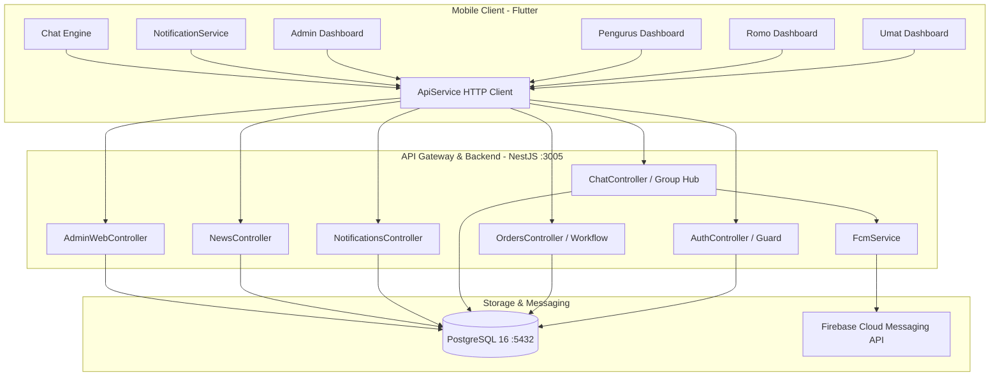
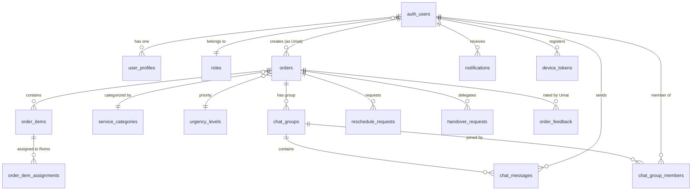

# 📘 CATU v2 — Master Architecture & Complete System Documentation

> **Aplikasi:** CATU (Catholic Assistance & Touch Unit) v2  
> **Tipe Dokumen:** Master Technical, Architecture & Application Specification Handover  
> **Branch Git:** `main` | **Terakhir Diperbarui:** 2 September 2026  
> **Target Pengguna:** AI Engineering Models, Full-Stack Developers, DevOps & QA Engineers

---

## 📑 Daftar Isi
1. [Gambaran Umum Sistem (System Overview)](#1-gambaran-umum-sistem-system-overview)
2. [Arsitektur Keseluruhan & Tech Stack](#2-arsitektur-keseluruhan--tech-stack)
3. [Peran Pengguna & Hirarki Hak Akses (User Roles & Permissions)](#3-peran-pengguna--hirarki-hak-akses-user-roles--permissions)
4. [Skema Database Lengkap (PostgreSQL ERD & Tables)](#4-skema-database-lengkap-postgresql-erd--tables)
5. [Spesifikasi Modul & Alur Bisnis (Core Business Modules)](#5-spesifikasi-modul--alur-bisnis-core-business-modules)
   - 5.1 [Autentikasi & Alur Persetujuan Bertingkat (Auth & Approval)](#51-autentikasi--alur-persetujuan-bertingkat-auth--approval)
   - 5.2 [Pemesanan Pelayanan: Sakramen Perminyakan](#52-pemesanan-pelayanan-sakramen-perminyakan)
   - 5.3 [Pemesanan Pelayanan: Misa Kedukaan Multi-Item](#53-pemesanan-pelayanan-misa-kedukaan-multi-item)
   - 5.4 [State Machine Siklus Status Pesanan (Order Lifecycle)](#54-state-machine-siklus-status-pesanan-order-lifecycle)
   - 5.5 [Fitur Reschedule (Perubahan Jadwal) & Handover (Pelimpahan Romo)](#55-fitur-reschedule-perubahan-jadwal--handover-pelimpahan-romo)
   - 5.6 [Fitur Group Chat Transaksi (WhatsApp-Style) & Read Receipts](#56-fitur-group-chat-transaksi-whatsapp-style--read-receipts)
   - 5.7 [Sistem Notifikasi Real-Time & FCM Push Engine](#57-sistem-notifikasi-real-time--fcm-push-engine)
   - 5.8 [Kalender Jadwal Pastoral & Riwayat Pelayanan](#58-kalender-jadwal-pastoral--riwayat-pelayanan)
   - 5.9 [Warta Gereja & Portal Berita Publik](#59-warta-gereja--portal-berita-publik)
   - 5.10 [Profil Pengguna & Lokalisasi Multi-Bahasa](#510-profil-pengguna--lokalisasi-multi-bahasa)
6. [Katalog REST API Backend (NestJS Endpoints)](#6-katalog-rest-api-backend-nestjs-endpoints)
7. [Struktur Kode Frontend Mobile (Flutter Architecture)](#7-struktur-kode-frontend-mobile-flutter-architecture)
8. [Konfigurasi Platform Native (Android & iOS)](#8-konfigurasi-platform-native-android--ios)
9. [Daftar Akun Uji Coba & Kredensial](#9-daftar-akun-uji-coba--kredensial)
10. [Panduan Menjalankan & Deployment Sistem](#10-panduan-menjalankan--deployment-sistem)

---

## 1. Gambaran Umum Sistem (System Overview)

**CATU (Catholic Assistance & Touch Unit) v2** adalah platform digital pastoral terpadu yang dirancang untuk memfasilitasi kebutuhan sakramental darurat dan pelayanan liturgi umat Katolik. Platform ini menghubungkan empat entitas utama secara real-time:

1. **Umat**: Mengajukan permohonan sakramen darurat (*Perminyakan Orang Sakit*) atau liturgi kedukaan (*Misa Kedukaan*), berinteraksi dalam grup obrolan transaksi, serta memantau status kehadiran Romo.
2. **Romo Paroki & Romo Ordo**: Menerima disposisi permintaan pelayanan, mengonfirmasi kehadiran, mengajukan perubahan jadwal (*reschedule*), melimpahkan tugas (*handover*), dan mengelola agenda pastoral.
3. **Pengurus Lingkungan / Wilayah**: Memvalidasi data pendaftaran umat baru, mendampingi umat yang berduka/sakit, dan memonitor jalannya pelayanan di lingkungannya.
4. **Sekretariat Paroki & Keuskupan (Admin)**: Mengelola master data gereja, jadwal pastoral, serta memantau statistik pelayanan keuskupan.

---

## 2. Arsitektur Keseluruhan & Tech Stack



### Spesifikasi Komponen:
* **Backend Framework:** NestJS 10 (Node.js runtime, TypeORM, TypeScript).
* **Database Relasional:** PostgreSQL 16 (`catu_v2_db`).
* **Mobile Framework:** Flutter 3.29+ / Dart 3.7+ (Material 3, iOS & Android).
* **Push Notifications:** Firebase Cloud Messaging (FCM Admin SDK) + Local Push Engine (`flutter_local_notifications: ^17.2.3`).
* **Kontainerisasi:** Docker Compose (`catu_backend`, `catu_postgres`, `catu_admin_web`, `catu_searxng`).

---

## 3. Peran Pengguna & Hirarki Hak Akses (User Roles & Permissions)

| Role Code | Nama Peran | Deskripsi Hak Akses & Fitur Utama |
| :--- | :--- | :--- |
| `UMAT` | Umat Paroki | • Membuat pesanan pelayanan (Perminyakan & Kedukaan)<br>• Chat transaksi dengan Romo & Pengurus<br>• Melihat riwayat, kalender jadwal, dan memberi rating pelayanan |
| `ROMO_PAROKI` | Romo Paroki (Diosesan) | • Menerima pesanan dalam parokinya<br>• Konfirmasi kehadiran / tolak / minta reschedule / handover<br>• Kalender jadwal pribadi & grup chat pelayanan |
| `ROMO_ORDO` | Romo Ordo / Religius | • Menerima pesanan lintas paroki dalam wilayah kabupaten/kota atau keuskupan<br>• Fitur penerimaan, reschedule, dan pencatatan komitmen liturgi |
| `PENGURUS` | Pengurus Lingkungan | • Menyetujui/menolak pendaftaran umat baru di lingkungannya<br>• Memantau seluruh permintaan pelayanan warga lingkungannya<br>• Berpartisipasi dalam grup chat pelayanan |
| `SUPERADMIN` | Administrator Sistem / Keuskupan | • Validasi akun Romo dan Pengurus Lingkungan<br>• Kelola master data paroki, lingkungan, berita, dan kategori pelayanan |

---

## 4. Skema Database Lengkap (PostgreSQL ERD & Tables)



### Rincian Tabel-Tabel Utama:

#### 1. `auth_users`
Menyimpan kredensial autentikasi.
* `id` (bigint, PK)
* `phone_number` (varchar 30, Unique)
* `password_hash` (varchar 255)
* `role_id` (bigint, FK `roles.id`)
* `account_status` (`ACTIVE`, `PENDING_APPROVAL`, `REJECTED`, `INACTIVE`)
* `created_at`, `updated_at` (timestamptz)

#### 2. `user_profiles`
Profil data diri pengguna gerejawi.
* `id` (bigint, PK)
* `user_id` (bigint, FK `auth_users.id` ON DELETE CASCADE)
* `full_name` (varchar 150)
* `baptism_name` (varchar 150) — Nama Baptis
* `family_card_number` (varchar 50) — No. KK Katolik / KK Sipil
* `keuskupan_id`, `paroki_id`, `wilayah_id`, `lingkungan_id` (bigint, FKs)
* `provinsi_id`, `kabupaten_kota_id`, `kecamatan_id`, `kelurahan_id` (bigint, FKs)
* `address_detail` (text)
* `avatar_url` (text)

#### 3. `orders` & `order_items`
Transaksi permohonan pelayanan sakramen.
* `orders`: `id`, `order_number` (e.g. `ORD-20260902-9637`), `user_id`, `service_category_id`, `urgency_level_id`, `scheduled_date`, `scheduled_time`, `location_name`, `address_detail`, `status` (`PENDING`, `CONFIRMED`, `IN_PROGRESS`, `COMPLETED`, `CANCELLED`), `patient_name`, `patient_condition`, `deceased_name`, `created_at`.
* `order_items`: Untuk Misa Kedukaan multi-sesi (`id`, `order_id`, `item_name`, `scheduled_date`, `scheduled_time_start`, `scheduled_time_end`, `location_name`, `status`).

#### 4. `order_item_assignments`
Pencatatan penugasan Romo pada pelayanan.
* `id` (bigint, PK)
* `order_id` (bigint, FK `orders.id`)
* `order_item_id` (bigint, FK `order_items.id`)
* `romo_id` (bigint, FK `auth_users.id`)
* `assigned_role` (`ROMO_UTAMA`, `ROMO_KONSELEBRAN`)
* `status` (`PENDING`, `ACCEPTED`, `DECLINED`, `HANDOVER_PENDING`)

#### 5. `chat_groups`, `chat_messages`, `chat_group_members`
Infrastruktur obrolan transaksi WhatsApp-style.
* `chat_groups`: `id`, `order_id`, `title`, `last_message_text`, `last_message_at`.
* `chat_messages`: `id`, `chat_group_id`, `sender_id`, `message_type` (`TEXT`, `IMAGE`, `LOCATION`, `SYSTEM_EVENT`), `message`, `attachment_url`, `created_at`.
* `chat_group_members`: `id`, `chat_group_id`, `user_id`, `role_in_group`, `last_read_message_id`.

#### 6. `notifications`
Penyimpanan notifikasi terintegrasi.
* `id` (bigint, PK)
* `user_id` (bigint, FK `auth_users.id`)
* `order_id` (bigint, FK `orders.id` NULL)
* `chat_group_id` (bigint, FK `chat_groups.id` NULL) — **Presisi multi-pesan**
* `title`, `body` (varchar/text)
* `type` (varchar 50: `CHAT_MESSAGE`, `NEW_REQUEST`, `ROMO_ACCEPTED`, `USER_APPROVAL`, dll)
* `is_read` (boolean, default false)
* `created_at` (timestamptz)

---

## 5. Spesifikasi Modul & Alur Bisnis (Core Business Modules)

### 5.1 Autentikasi & Alur Persetujuan Bertingkat (Auth & Approval)
* **Pendaftaran Umat**:
  1. Umat mengisi nomor HP, kata sandi, nama lengkap, nama baptis, data paroki & lingkungan.
  2. Status akun awal: `PENDING_APPROVAL`.
  3. Notifikasi dikirimkan ke **Pengurus Lingkungan**.
  4. Pengurus Lingkungan membuka menu *Persetujuan Umat*, memverifikasi data, lalu menyetujui (`ACTIVE`) atau menolak (`REJECTED`).
* **Pendaftaran Romo & Pengurus**:
  1. Romo Ordo, Romo Paroki, atau Pengurus Lingkungan mendaftar.
  2. Status awal `PENDING_APPROVAL`, persetujuan diverifikasi oleh **Superadmin / Sekretariat Keuskupan**.

### 5.2 Pemesanan Pelayanan: Sakramen Perminyakan
* Formulir dibuat cepat untuk kebutuhan darurat.
* Input: Nama Orang Sakit, Kondisi Medis (Kritis / Sadar / Di ICU), Tingkat Urgensi, Lokasi (Rumah Sakit / Rumah Tinggal), Waktu Pelayanan, dan Opsi Paroki Asal vs Paroki Berbeda.
* Begitu disimpan, notifikasi langsung dikirim ke Romo Paroki & Romo Ordo yang relevan.

### 5.3 Pemesanan Pelayanan: Misa Kedukaan Multi-Item
* Memungkinkan keluarga yang berduka memesan paket misa kedukaan lengkap dalam 1 formulir:
  1. **Misa Malam Kembang / Penghiburan**
  2. **Misa Penutupan Peti**
  3. **Misa Pelepasan / Pemakaman**
  4. **Misa Requiem / Peringatan Arwah (3/7/40/1000 Hari)**
* Setiap item memiliki tanggal, jam, dan lokasi tersendiri, serta otomatis dibentuk grup chat transaksinya.

### 5.4 State Machine Siklus Status Pesanan (Order Lifecycle)

```
[ DRAFT / SUBMITTED ] 
          │
          ▼
     [ PENDING ] ── (Romo Menolak) ──► [ DECLINED / SEARCHING_NEXT ]
          │
    (Romo Konfirmasi)
          │
          ▼
    [ CONFIRMED ] ── (Ajukan Ubah Jadwal) ──► [ RESCHEDULE_PROPOSED ]
          │                                              │
          │◄────────── (Umat Setuju Jadwal) ─────────────┘
          ▼
   [ ROMO_ON_WAY ]
          │
          ▼
   [ IN_PROGRESS ]
          │
          ▼
    [ COMPLETED ] ──► [ RATING & FEEDBACK ]
```

### 5.5 Fitur Reschedule & Handover (Pelimpahan)
* **Reschedule**: Romo dapat mengajukan alternatif tanggal/jam baru. Umat menerima dialog notifikasi pop-up dengan tombol *Setujui* atau *Tolak*.
* **Handover**: Jika Romo berhalangan mendadak, Romo dapat melimpahkan tugas ke Romo lain di paroki/ordonya.

### 5.6 Fitur Group Chat Transaksi (WhatsApp-Style)
* Auto-creation: Grup dibuat otomatis per transaksi pesanan pelayanan.
* Fitur pesan:
  * Pengiriman teks cepat & emoji.
  * Unggah foto/gambar lampiran.
  * Berbagi titik lokasi (Google Maps latitude/longitude).
* **Indikator Centang Biru (*Read Receipts*)**:
  * Centang 1 (Abu-abu): Pesan terkirim ke server.
  * Centang 2 (Abu-abu): Pesan masuk ke grup.
  * Centang 2 (Biru): Seluruh anggota telah membuka ruang chat (dibandingkan melalui `last_read_message_id`).

### 5.7 Sistem Notifikasi Real-Time & FCM Push Engine
* **Dual-Delivery Mode**:
  1. *Foreground Active*: Polling 3 detik (`NotificationService.startPolling`) memeriksa delta notifikasi belum dibaca di database PostgreSQL.
  2. *Background / Closed App*: FCM Push Notification dikirim ke `device_tokens` HP melalui Firebase Cloud Messaging.
* **Smart Deep-Link Navigation**:
  * Ketuk notifikasi `CHAT_MESSAGE` ➔ Membuka ruang chat spesifik (`ChatScreen`).
  * Ketuk notifikasi umum (`NEW_REQUEST`, `ROMO_ACCEPTED`, dll) ➔ Membuka layar daftar pemberitahuan (`NotificationScreen`).

---

## 6. Katalog REST API Backend (NestJS Endpoints)

| Method | Endpoint | Deskripsi & Kegunaan |
| :--- | :--- | :--- |
| `POST` | `/auth/login` | Login nomor HP & kata sandi |
| `POST` | `/auth/register` | Pendaftaran akun baru (Umat / Romo / Pengurus) |
| `GET` | `/auth/pengurus/pending-umat` | Ambil daftar umat yang butuh persetujuan Pengurus |
| `POST` | `/auth/pengurus/approve-umat/:id`| Setujui pendaftaran akun umat |
| `POST` | `/orders` | Buat permintaan pelayanan baru (Perminyakan / Kedukaan) |
| `GET` | `/orders` | Ambil daftar pesanan (dengan filter `userId`, `romoId`, `parokiId`) |
| `GET` | `/orders/:id` | Ambil rincian lengkap pesanan & item-itemnya |
| `POST` | `/assignments/respond` | Romo menerima (`ACCEPTED`) atau menolak (`DECLINED`) pesanan |
| `POST` | `/assignments/reschedule` | Romo mengajukan pergeseran jadwal pelayanan |
| `POST` | `/assignments/handover` | Romo melimpahkan pelayanan ke Romo lain |
| `POST` | `/orders/:id/feedback` | Umat mengirim ulasan & rating bintang pelayanan |
| `GET` | `/chat/groups/:id/messages` | Ambil riwayat percakapan grup chat & read status |
| `POST` | `/chat/groups/:id/messages` | Kirim pesan chat (Teks / Gambar / Lokasi) |
| `POST` | `/chat/groups/:id/read` | Tandai seluruh pesan dalam grup telah dibaca |
| `GET` | `/chat/user/:userId/groups` | Ambil daftar grup chat yang diikuti pengguna |
| `GET` | `/notifications` | Ambil daftar notifikasi (filter `userId`) |
| `POST` | `/notifications/:id/read` | Tandai 1 notifikasi telah dibaca |
| `POST` | `/notifications/read-all` | Tandai seluruh notifikasi pengguna telah dibaca |
| `POST` | `/notifications/register-token` | Daftarkan FCM token perangkat |
| `GET` | `/news` | Ambil daftar warta & berita gereja publik |

---

## 7. Struktur Kode Frontend Mobile (Flutter Architecture)

```
mobile/
├── lib/
│   ├── core/
│   │   ├── constants/app_constants.dart       # Warna tema, margin, asset paths
│   │   ├── models/models.dart                 # Data classes (Order, User, Chat, Notification)
│   │   ├── models/news_model.dart             # Model warta gereja
│   │   ├── services/api_service.dart          # HTTP Client REST API CATU
│   │   ├── services/notification_service.dart # Local Notif, FCM, Polling, & Deep-Linking
│   │   ├── services/language_service.dart     # Multi-bahasa (ID / EN)
│   │   ├── utils/fade_slide_route.dart        # Animasi transisi halaman
│   │   └── widgets/liquid_bottom_nav_bar.dart # Bottom navigation bar custom
│   ├── features/
│   │   ├── admin/                             # Approval screens untuk Pengurus & Romo
│   │   ├── auth/                              # Login, Register, Forgot Password, Pending State
│   │   ├── chat/                              # ChatListScreen, ChatScreen (WhatsApp-style)
│   │   ├── home/                              # HomeScreen, UmatDashboard, RomoDashboard
│   │   ├── news/                              # PublicNewsScreen, NewsDetailScreen
│   │   ├── notifications/                     # NotificationScreen (Filter, search, actions)
│   │   ├── orders/                            # CreateKedukaan, CreatePerminyakan, OrderDetail, Schedule
│   │   └── profile/                           # Profile, Edit Profile, Keuskupan/Paroki selection
│   └── main.dart                              # Entry point, theme provider, navigatorKey
```

---

## 8. Konfigurasi Platform Native (Android & iOS)

### Android:
* **Package Name:** `com.example.catu_mobile` (atau `com.example.catuMobile`)
* **Ikon Notifikasi Native:**
  * Status Bar Icon: `@drawable/ic_stat_catu` (Siluet putih transparan RGBA).
  * Banner LargeIcon: `@drawable/ic_catu_logo` (Logo CATU berwarna 192x192).
* **Notification Channel:** `catu_high_importance_channel` (Importance: Max, Sound: True, Vibration: True).

### iOS:
* **Bundle ID:** `com.example.catuMobile`
* **Delegate Notifikasi:** `UNUserNotificationCenter.current().delegate = self as UNUserNotificationCenterDelegate` pada `AppDelegate.swift`.
* **Izin Runtime:** Darwin `requestPermissions(alert: true, badge: true, sound: true)` dan `DarwinNotificationDetails(presentBanner: true, presentList: true)`.

---

## 9. Daftar Akun Uji Coba & Kredensial

| Peran Akun | Nomor HP | Kata Sandi Default | ID Pengguna | Keterangan Uji |
| :--- | :--- | :--- | :--- | :--- |
| **Umat** | `08123321123` | `password123` | `8` | Umat Paroki St. Agustinus (Paroki 256) |
| **Romo Ordo** | `0878787878` | `password123` | `13` | Romo Ordo Wilayah Kab. 3173 |
| **Pengurus** | `081299998888` | `password123` | `9` | Pengurus Lingkungan 1007 |
| **Admin** | `0811111111` | `admin123` | `1` | Superadmin Keuskupan |

---

## 10. Panduan Menjalankan & Deployment Sistem

### A. Menjalankan Backend & Database (Docker)
```bash
cd /Users/admin/Projects/CATU

# 1. Jalankan seluruh container (Postgres, Backend, Admin Web)
docker-compose up -d

# 2. Cek status container yang sedang berjalan
docker ps

# 3. Pantau log backend secara live
docker logs -f catu_backend
```

### B. Menjalankan Flutter Mobile Client
```bash
cd /Users/admin/Projects/CATU/mobile

# 1. Jalankan di iPhone 16 Pro Simulator (iOS)
flutter run -d 8178DDE6-D46E-4088-A2AC-76DB4D226DD2

# 2. Jalankan di HP Android (Wireless Debugging)
adb mdns services
adb connect 10.0.10.35:<port_terdeteksi>
flutter run -d 10.0.10.35:<port_terdeteksi>
```

### C. Menghentikan Seluruh Layanan
```bash
# 1. Hentikan container Docker
cd /Users/admin/Projects/CATU && docker-compose stop

# 2. Putuskan koneksi debugging ADB jika diperlukan
adb disconnect
```
